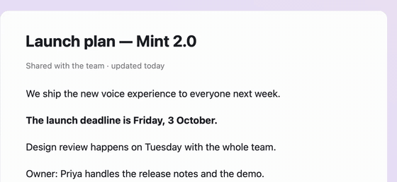
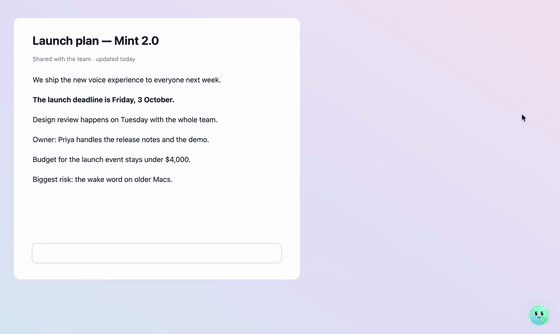

<div align="center">

# Hey Mint

**An open-source, Jarvis-style voice assistant for macOS.**
Say “Hey Mint” and it talks back, clicks and types in your apps, browses, manages files,
marks things on your screen, and hands long jobs to a family of background agents.

[**Illustrated guide**](https://hey-mint.pages.dev/) ·
[Install](#install) ·
[What it can do](#what-it-can-do) ·
[How it works](#how-it-works) ·
[Development](#development) ·
[Contributing](CONTRIBUTING.md)


</div>

<br>

https://github.com/user-attachments/assets/24e6249c-3859-4013-8a46-baf96e40488b

<p align="center">
  <sub>▶ <b>The 1-minute film</b> · unmute for the voiceover · also on <a href="https://youtu.be/OfXFNvbwlT0">YouTube</a></sub>
</p>

<br>

<p align="center">
  
</p>

## What it can do

Mint is a small orb with a face that lives in the corner of your screen. Ask in your own
words: say “Hey Mint”, press <kbd>⌃⌥Space</kbd>, or type (<kbd>⌘J</kbd>). Like the Dynamic Island,
the orb changes shape for what's going on: a meeting recorder, your day's schedule, a lesson,
a video it's watching, an answer as a card.

| Ask | What happens |
|---|---|
| “open Figma”, “switch to the Jira tab” | Opens or switches apps, windows and browser tabs |
| “click Sign in”, “type ‘see you at six’”, “read this page” | Finds controls by name through Accessibility, presses them like a person, checks it worked |
| “find the PDF about the lease and summarise it” | Spotlight search, reads PDFs / Word / Markdown / CSV, writes and edits files (with backups) |
| “put YouTube and anime in a group called Entertainment” | Full browser control: tabs, forms, tab groups, extension buttons (Chrome, Safari, Brave, Arc, Edge) |
| “where's the deadline in this PDF?” | Finds the words on screen, scrolls to them, and boxes, underlines, highlights, circles or points at them |
| “remind me to call Sam at five”, “what's on today?” | Calendar, reminders, notes, timers, email drafts, volume, media keys, screenshots, clipboard |
| “have Astra research the best keyboards and write a brief” | Background agents (research, code, documents, websites) that ask questions, team up and report back |
| “remember my manager is Meera”, “save how to do that as a skill” | Long-term memory and self-learned skills, both editable |
| “watch this video: what's the aesthetic?”, “what did he say at 3:20?” | Understands a video (link, file or the one on screen) in seconds from its transcript and a few keyframes, with timestamps |
| “every weekday at 9, brief me on my calendar and mail”, “when a PDF lands in Downloads, file it” | Automations: schedules, folder and app triggers, reminders before meetings |
| *(on a call, press ● on the orb)* “what did we decide in the Acme call?” | Meeting notes with no bot: the orb turns into a recorder (mic and video switches), then a transcript, decisions and action items; “what's been said so far?” mid-call |
| *hold Right ⌥ and talk* | Dictation, Wispr-Flow style: let go and clean text is typed where your cursor is (fillers dropped, corrections applied, Hindi or English) |
| “let me know when this download finishes”, “tell me when the Claude session is done” | Trackers: downloads, Claude Code sessions, Terminal commands, uploads in any window, files; Mint speaks up the moment they finish |
| “watch me do this once”, “show me how to export a PDF in Preview” | Learns a task from one demonstration; or guides you step by step, pointing at each control |
| “good morning, brief me”, “turn on the living room lights”, “find the screenshot with the invoice number” | A spoken daily briefing, your Apple Shortcuts (Home scenes, Focus, music), screenshots found by what's in them |
| “translate this page”, “triage my email”, “draft a reply saying I'll send it Friday” | Translations written over the original, in its own colours; inbox sorted by what needs you; replies drafted in your style (never sent) |
| “OCR this and copy it”, “make an Excel of this table”, “convert this English PDF to a Hindi Word doc” | Text off any screen or scan to the clipboard; tables to a clean .xlsx; documents translated and converted with headings, lists and tables kept |
| “make it vertical for Reels and add captions”, “remove the silent parts”, “compress it under 25 MB” | Video editing by voice: planned by Gemini, rendered with ffmpeg next to the original, then checked (QA) |
| “brighter”, “Chrome left, Slack right”, “turn on Do Not Disturb”, “record just this part of the screen” | Your Mac's switches (brightness, keep awake, Focus, Night Shift, windows via Rectangle) and screen recordings of the screen, a window or an area you describe |
| *drag a file onto Mint* | Drop files, folders or text on the orb: it offers what fits (summarise, translate, spreadsheet, captions, transcribe) |
| *a Telegram message or voice note from your phone* | Remote control from anywhere through your own Telegram bot: Mint does it on the Mac and shows each step in the chat, then the reply, screenshots and files |
| “ask ChatGPT to outline the talk”, “is Claude still working?”, “tell me when Claude is done” | Drives the ChatGPT and Claude desktop apps: asks, reads replies, opens and lists chats and Claude Code sessions, and tells you when they finish |
| “open my clipboard”, “paste the last 5 screenshots in the chat”, “pin this as my address” | A clipboard that remembers everything you copy and every screenshot: Mint turns into it (⌃⌥V), pick several in order, pin up to 20, passwords and keys go to the Keychain |
| “what did I miss?”, “undo that”, “merge these folders, keep the newest” | Reads and clears your notifications; undoes what Mint just did (brightness, windows, text, files, reminders); merges folders keeping the newest copy |
| “make an illustration of a lighthouse at sunset”, “add a sailing boat”, “make me a shortcut that turns on dark mode” | Pictures drawn on your Mac by Apple's Image Playground, edited by describing a change; new Apple Shortcuts planned from plain words |
| “Hey Jarvis” (your own wake word), “always answer in Hindi” | Train a wake word of your own on your Mac in about a minute and a half; pick the language Mint answers in |
| “make this more formal”, “put these invoices in a spreadsheet”, “clean up my Downloads” | Rewrites selected text in place, turns documents into an .xlsx, tidies folders with a preview and an undo |
| “where were we?”, “what did we do yesterday?”, “what was I working on on Monday?” | Tasks that survive restarts and grow sub-steps, a journal of what happened when, and an opt-in activity timeline |
| “do a trick”, “show me a heart”, “put on a show” | Expressions, 60 fps tricks, and a critter family that performs |

<p align="center">
  
</p>

<p align="center">
  
</p>

<p align="center">
  
  
</p>

<p align="center">
  
</p>

### Agents that pop out of a toy box

Long jobs go to named agents (Astra researches, Luna codes, Sage writes, Codex builds sites).
Each shows up as a little critter beside the orb: it thinks, shows what tool it is using,
asks you questions, calls teammates in, and hops back into the box when done.

<p align="center">
  
  
</p>

Everything is in the **[illustrated guide](https://hey-mint.pages.dev/)**, with a
short clip of every feature and a live orb on the page that acts out the examples.

## Install

### Download the app (easiest)

**What you need:** an Apple silicon Mac (M1 or later) on macOS 14.2+, an internet connection,
and a free [Gemini API key](https://aistudio.google.com/apikey). That's all: the app carries its own
Python, libraries and models, and nothing else has to be installed.

Optional extras, each unlocking one thing:

| Extra | Unlocks |
|---|---|
| OpenAI API key (asked for on first launch) | Background agents: research, documents, code |
| The [ChatGPT app](https://openai.com/chatgpt/desktop/) (it brings Codex) | The agent that builds websites and code projects |
| TypeSafe key (asked for on first launch) | Jev: the `desktop` tool (multi-step clicking and typing in any app, by the engine built into Mint) and surer picks of which button, skill or memory is meant |

1. Download the latest **Hey-Mint-…-arm64.dmg** from [Releases](https://github.com/shivatmax/hey-mint/releases/latest)
   (Apple silicon Macs, macOS 14.2 or later). Everything it needs is inside: no Python, Homebrew or Xcode.
2. Open the DMG and drag **Hey Mint** into **Applications**, then open it.
3. First time only: if macOS says it cannot check the app for malware, open **System Settings ▸ Privacy &
   Security** and click **Open Anyway**. (Release builds are not notarized by Apple yet.)
4. Paste your free [Gemini API key](https://aistudio.google.com/apikey); the OpenAI and Jev keys are optional.
   Hold <kbd>⌥</kbd> while opening Hey Mint to change keys later.
5. The welcome window takes it from there (about two minutes, Esc skips): your name and what to call Mint, a
   voice, each permission with why it's needed and an Allow button (Microphone is the one it needs), your
   shortcuts, and a tour of what Mint can do. It's in the menu bar as **Welcome tour…** any time later.

<p align="center">
  
</p>

Your keys, settings, memory and skills live in `~/Library/Application Support/Hey Mint`. To update,
replace the app with a newer one; your data stays.

### Build from source

Requirements: a recent macOS on Apple silicon or Intel, Python 3.11+ (`python3`), the Xcode command line tools
(`xcode-select --install`), and a [Gemini API key](https://aistudio.google.com/apikey).

```sh
git clone https://github.com/shivatmax/hey-mint.git
cd hey-mint
./set-key.sh          # paste your Gemini key (stored in .env, readable only by you)
./install.sh          # builds ~/Applications/Mint.app
open ~/Applications/Mint.app
```

macOS asks for the **Microphone** first. Grant **Accessibility** from the menu bar icon so
Mint can click and type. Screen Recording, Automation, Calendars, Reminders and Files and
Folders are asked for the first time a feature needs them.

Optional keys in `.env`:

| Key | For |
|---|---|
| `TYPESAFE_API_KEY` | Jev, the fast chooser (which button, which skill, which memory), and the `desktop` tool |
| `OPENAI_API_KEY` or `OPENROUTER_API_KEY` | Background agents (GPT-6 Luna) |
| `EXA_API_KEY` or `TAVILY_API_KEY` | Better web search (DuckDuckGo is used without one) |

Then say **“Hey Mint”**, or press <kbd>⌘J</kbd> and type. For hands-free use only by you,
train your voice once: menu bar ▸ **Train my voice…** (two minutes).

Personal settings live in files that are ignored by git: copy `custom.example.json` to
`custom.json` for your accounts, Slack workspaces, aliases and routines.

## How it works

```
 you ──voice──▶ "Hey Mint" detector (on device) ──▶ voice lock (only your voice)
                                                        │
                                                        ▼
                         Gemini Live  ◀── listens, talks, plans, calls tools
                             │
          ┌──────────────────┼───────────────────────────┐
          ▼                  ▼                           ▼
  104 tools on the Mac   Jev (fast choices from     Agents (GPT-6 Luna, Codex)
   Accessibility, menus,  real lists: controls,      research, code, documents,
   AppleScript, files,    skills, memories, apps)    websites; work as a team
   browser, Vision OCR
          │
          ▼
   the orb, captions, marks and critters (Core Animation, hidden from screen capture)
```

- **Direct routes first.** Menus, the accessibility tree, AppleScript and web APIs before
  pixels; the pointer moves only when nothing else can do the job.
- **On device where it matters.** The wake word, the voice lock and speaker checks run
  locally; nothing leaves the Mac while Mint is asleep.
- **Learns.** Tasks that took many steps or needed your correction become skills, ranked
  by how often they work.
- **Remembers well.** The memory keeps separate stores, each with its own job:
  - facts about you, which are replaced (not piled up) when they change, remember what they used to
    say, and are tidied once a day;
  - a journal of what happened when;
  - plans that outlive a restart;
  - an opt-in, text-only timeline of what was on screen.
- **Cheap to watch.** Videos become a transcript (the site's captions when there are any) and about
  12 keyframes on one contact sheet: about 6k tokens for a 15-minute talk instead of about 180k.

How the pieces fit together is in [docs/architecture.md](docs/architecture.md); every command and
tool is in [docs/usage.md](docs/usage.md); working on Mint is in [docs/development.md](docs/development.md).

## Reliability

`bench/reliability/` holds 70 realistic, long tasks (files, documents, spreadsheets, Reminders, Notes, Calendar, Mail drafts, the web, clipboard, video, memory, agents), each with its own complications - typos, locked files, pages that fail, two- and four-turn follow-ups - set up in a sandbox, sent to the running app and checked by the end state, not by what Mint says. The latest full run passed 67 of 70; the three misses were fixed since. Run it with `bench/reliability/run.py` (see its README).

## Privacy and safety

- Never enters passwords or card numbers, never fills password fields, never stores
  secrets in files, skills or memory.
- Never sends email (drafts only); messages, posts and forms go out only when you asked.
- “Delete” means the Trash; files are backed up before being overwritten; private folders
  (keys, keychains, browser profiles, Mail, Messages) are off limits.
- Invisible in screen shares by default (“Mint, be visible” to show it in a Google Meet).
- Dictation listens only while you hold the key; meeting and screen recordings start only when you
  press record (a window or area is shown first and needs your yes).
- Trackers read local files only: the browser's partial download, a Claude session's own log, a
  terminal tab's running process.
- “Stop” halts everything at once.

## Project layout

```
mint/
  app/         startup, the Gemini Live session, lifecycle
  core/        configuration, preferences, Jev, shortcuts
  voice/       audio engine, wake word, voice lock, enrolment
  knowledge/   conversation, memory, learned skills
  tools/       everything Gemini can call (apps, files, web, browser, clipboard…)
  screen/      accessibility, grounding, text recognition, vision
  ui/          the orb, chat, settings, marks, critters, effects
  agents/      background agents, Codex, teams
  resources/   example skills
launcher/      Mint.app's launcher, the low-memory Mint Ear, the screen-control engine, the meeting
               recorder (MintRecorder) and the screen recorder (MintScreen) - all Swift
packaging/     building the downloadable app and DMG
guide/         the illustrated guide (static site)
docs/          architecture, usage and development handbook
tests/         offline checks (pytest)
scripts/       training the wake word model
models/        the "Hey Mint" wake word model
```

## Development

The full handbook is **[docs/development.md](docs/development.md)**: running from a checkout,
where new code goes, tests, the guide, building the Mac app, and releasing.

### Get going

```sh
git clone https://github.com/shivatmax/hey-mint.git && cd hey-mint
make setup      # .venv with the dependencies, pytest and ruff
./set-key.sh    # your Gemini key, saved in .env (never committed)
make demo       # the animation tour, no API key needed
make run        # run Mint from the checkout, logs in the terminal
```

Handy while working:

```sh
.venv/bin/python -m mint --tool get_status '{}'   # run one tool directly, no Gemini
.venv/bin/python -m mint --text                   # type to Mint instead of speaking
.venv/bin/python -m mint --say "open Notes"       # send a request to the running Mint
tail -f ~/Library/Logs/Mint/mint.log              # what Mint is doing
```

From a checkout, macOS asks for Microphone and Accessibility on behalf of your terminal. To
try your changes as the real menu bar app, run `./install.sh` and open `~/Applications/Mint.app`
again after each change. It keeps its own data, so your everyday Mint is untouched.

### Check your changes

```sh
make lint       # ruff (CI runs this)
make test       # offline checks (CI runs this)
make test-all   # also network, AppleScript and file checks
```

### Build the Mac app

```sh
make app        # dist/Hey Mint.app and dist/Hey-Mint-<version>-arm64.dmg
```

One command builds a self-contained app: a bundled Python, every library, the models and
Mint's code. People who install the DMG need nothing else. It needs an Apple silicon Mac,
the Xcode command line tools and `brew install portaudio`. Set `SIGN_IDENTITY` and
`NOTARY_PROFILE` to sign with a Developer ID and notarize ([details](docs/development.md#signing-and-notarization)).

### Release a version

Bump `version` in `pyproject.toml`, add a `CHANGELOG.md` entry, then push a tag:

```sh
git commit -am "Release 0.2.0"
git tag -a v0.2.0 -m "Hey Mint 0.2.0"
git push origin main v0.2.0
```

GitHub Actions builds the app on an Apple silicon runner and publishes it on the
[Releases](https://github.com/shivatmax/hey-mint/releases) page with install steps, in about
five minutes.

| Workflow | Runs on | Does |
|---|---|---|
| [CI](.github/workflows/ci.yml) | every push and pull request | lint and offline tests on macOS |
| [Release](.github/workflows/release.yml) | a `v*` tag | builds, signs (if set up) and publishes the DMG |
| [Guide](.github/workflows/cloudflare.yml) | changes to `guide/` on `main` | deploys [hey-mint.pages.dev](https://hey-mint.pages.dev/) (needs the Cloudflare secrets) |

## Contributing

Issues and pull requests are welcome. Start with [CONTRIBUTING.md](CONTRIBUTING.md) and
[docs/development.md](docs/development.md), and see the [code of conduct](CODE_OF_CONDUCT.md).
Security issues: [SECURITY.md](SECURITY.md).

## License

Copyright © 2026 shivatmax (github.com/shivatmax). Hey Mint is free software under the
[GNU General Public License v3.0 or later](LICENSE): use it, study it, share it and change it. If you
distribute a modified version, it must stay open source under the same licence.

- **Building Hey Mint into a closed-source product?** A commercial licence is available. Open an issue or
  get in touch through [github.com/shivatmax](https://github.com/shivatmax).
- **The name, logo and orb character** are not covered by the GPL. See [TRADEMARKS.md](TRADEMARKS.md);
  forks need their own name.
- **Contributing** needs a one-time [Contributor License Agreement](CLA.md) (a bot asks on your first
  pull request). See [CONTRIBUTING.md](CONTRIBUTING.md).
- **Privacy:** what stays on your Mac and what goes where. See [PRIVACY.md](PRIVACY.md).

Built with [Gemini Live](https://ai.google.dev/), [openWakeWord](https://github.com/dscripka/openWakeWord),
[3D-Speaker CAM++](https://github.com/modelscope/3D-Speaker) via
[sherpa-onnx](https://github.com/k2-fsa/sherpa-onnx), [PyObjC](https://pyobjc.readthedocs.io/),
and Apple's Accessibility, Vision and Core Animation frameworks. Hey Mint is an independent
project, not affiliated with Apple, Google or OpenAI.
