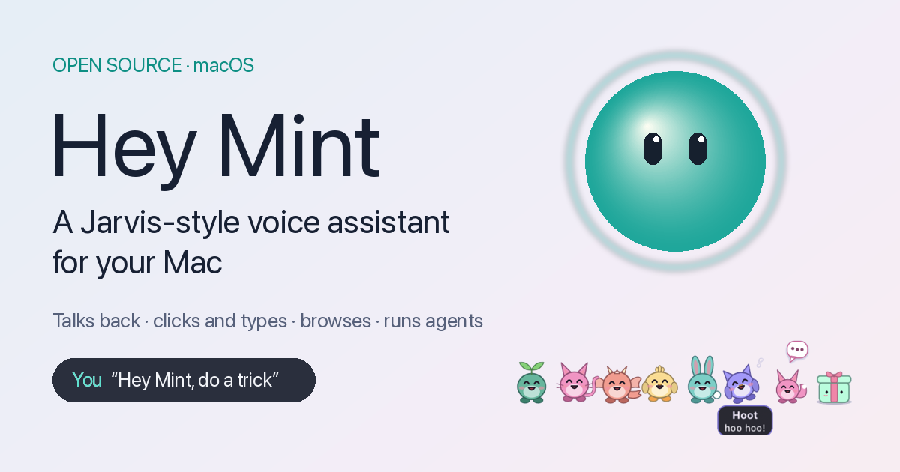

<div align="center">



# Hey Mint

**An open-source, Jarvis-style voice assistant for macOS.**
Say “Hey Mint” and it talks back, clicks and types in your apps, browses, manages files,
marks things on your screen, and hands long jobs to a family of background agents.

[**Illustrated guide**](https://hey-mint.pages.dev/) ·
[Install](#install) ·
[What it can do](#what-it-can-do) ·
[How it works](#how-it-works) ·
[Contributing](CONTRIBUTING.md)


</div>

<p align="center">
  
</p>

## What it can do

Mint is a small orb with a face that lives in the corner of your screen. Ask in your own
words, by voice or by typing (<kbd>⌘J</kbd>):

| Ask | What happens |
|---|---|
| “open Figma”, “switch to the Jira tab” | Opens or switches apps, windows and browser tabs |
| “click Sign in”, “type ‘see you at six’”, “read this page” | Finds controls by name through Accessibility, presses them like a person, checks it worked |
| “find the PDF about the lease and summarise it” | Spotlight search, reads PDFs / Word / Markdown / CSV, writes and edits files (with backups) |
| “put YouTube and anime in a group called Entertainment” | Full browser control: tabs, forms, tab groups, extension buttons (Chrome, Safari, Brave, Arc, Edge) |
| “where's the deadline in this PDF?” | Finds the words on screen, scrolls to them, and boxes, underlines, highlights, circles or points at them |
| “remind me to call Sam at five”, “what's on today?” | Calendar, reminders, notes, timers, email drafts, volume, media keys, screenshots, clipboard |
| “have Astra research the best keyboards and write a brief” | Background agents (research, code, documents, websites) that ask questions, team up and report back |
| “remember my manager is Meera”, “save how to do that as a skill” | Long-term memory and self-learned skills, both editable |
| “do a trick”, “show me a heart”, “put on a show” | Expressions, 60 fps tricks, and a critter family that performs |

<p align="center">
  
</p>

### Agents that pop out of a toy box

Long jobs go to named agents (Astra researches, Luna codes, Sage writes, Codex builds sites).
Each shows up as a little critter beside the orb: it thinks, shows what tool it is using,
asks you questions, calls teammates in, and hops back into the box when done.

<p align="center">
  
  
</p>

Everything is in the **[illustrated guide](https://hey-mint.pages.dev/)**, with a
short clip of every feature and a live orb on the page that acts out the examples.

## Install

Requirements: a recent macOS on Apple silicon or Intel, Python 3.10+ (`python3`), the Xcode command line tools
(`xcode-select --install`), and a [Gemini API key](https://aistudio.google.com/apikey).

```sh
git clone https://github.com/shivatmax/hey-mint.git
cd hey-mint
./set-key.sh          # paste your Gemini key (stored in .env, readable only by you)
./install.sh          # builds ~/Applications/Mint.app
open ~/Applications/Mint.app
```

macOS asks for the **Microphone** first. Grant **Accessibility** from the menu bar icon so
Mint can click and type. Screen Recording, Automation, Calendars, Reminders and Files and
Folders are asked for the first time a feature needs them.

Optional keys in `.env`:

| Key | For |
|---|---|
| `TYPESAFE_API_KEY` | Jev, the fast chooser (which button, which skill, which memory) |
| `OPENAI_API_KEY` or `OPENROUTER_API_KEY` | Background agents (GPT-6 Luna) |
| `EXA_API_KEY` or `TAVILY_API_KEY` | Better web search (DuckDuckGo is used without one) |

Then say **“Hey Mint”**, or press <kbd>⌘J</kbd> and type. For hands-free use only by you,
train your voice once: menu bar ▸ **Train my voice…** (two minutes).

Personal settings live in files that are ignored by git: copy `custom.example.json` to
`custom.json` for your accounts, Slack workspaces, aliases and routines.

## How it works

```
 you ──voice──▶ "Hey Mint" detector (on device) ──▶ voice lock (only your voice)
                                                        │
                                                        ▼
                         Gemini Live  ◀── listens, talks, plans, calls tools
                             │
          ┌──────────────────┼───────────────────────────┐
          ▼                  ▼                           ▼
   88 tools on the Mac   Jev (fast choices from     Agents (GPT-6 Luna, Codex)
   Accessibility, menus,  real lists: controls,      research, code, documents,
   AppleScript, files,    skills, memories, apps)    websites; work as a team
   browser, Vision OCR
          │
          ▼
   the orb, captions, marks and critters (Core Animation, hidden from screen capture)
```

- **Direct routes first.** Menus, the accessibility tree, AppleScript and web APIs before
  pixels; the pointer moves only when nothing else can do the job.
- **On device where it matters.** The wake word, the voice lock and speaker checks run
  locally; nothing leaves the Mac while Mint is asleep.
- **Learns.** Tasks that took many steps or needed your correction become skills, ranked
  by how often they work.

The engineering notes, measurements and design decisions behind each part are in
[docs/ENGINEERING.md](docs/ENGINEERING.md); the full command reference is in [GUIDE.md](GUIDE.md).

## Privacy and safety

- Never enters passwords or card numbers, never fills password fields, never stores
  secrets in files, skills or memory.
- Never sends email (drafts only); messages, posts and forms go out only when you asked.
- “Delete” means the Trash; files are backed up before being overwritten; private folders
  (keys, keychains, browser profiles, Mail, Messages) are off limits.
- Invisible in screen shares by default (“Mint, be visible” to show it in a Google Meet).
- “Stop” halts everything at once.

## Project layout

| Path | What |
|---|---|
| `mint/` | The assistant (Python, PyObjC): session, tools, orb and UI, agents, voice |
| `mint/agents/` | Background agents, the Codex runner, teams |
| `launcher/` | Mint.app's launcher and the low-memory “Mint Ear” (Swift) |
| `guide/` | The illustrated guide (static site, deployed to GitHub Pages) |
| `bench/` | Benchmarks and live tests |
| `models/` | The “Hey Mint” wake word model |

Development: `.venv/bin/python -m mint --demo` plays the animation tour;
`--say "do a trick"` talks to the running app by text; re-run `./install.sh` after changes.

## Contributing

Issues and pull requests are welcome. See [CONTRIBUTING.md](CONTRIBUTING.md) and the
[code of conduct](CODE_OF_CONDUCT.md). Security issues: [SECURITY.md](SECURITY.md).

## License

[GNU General Public License v3.0](LICENSE). You may use, study, share and modify Hey Mint;
if you distribute a modified version, it must stay open source under the same license.

Built with [Gemini Live](https://ai.google.dev/), [openWakeWord](https://github.com/dscripka/openWakeWord),
[3D-Speaker CAM++](https://github.com/modelscope/3D-Speaker) via
[sherpa-onnx](https://github.com/k2-fsa/sherpa-onnx), [PyObjC](https://pyobjc.readthedocs.io/),
and Apple's Accessibility, Vision and Core Animation frameworks. Hey Mint is an independent
project, not affiliated with Apple, Google or OpenAI.
